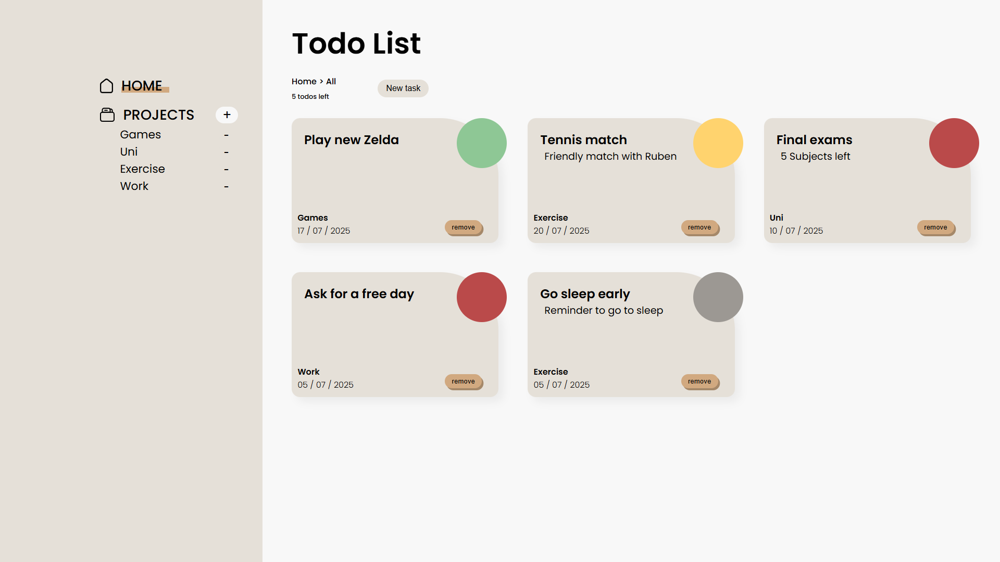

# Todo List

A simple and effective Todo List application to help you organize your tasks and boost productivity.

## Features

### Availlable
- Create and remove existent projects
- Add new tasks with the next information:
    - Task title
    - Brief description
    - Projet relation
    - Priority (High, medium, low and none)
    - Due date
- See all the tasks left in a counter
- Remove tasks
- Local storage for the tasks and projects

### Comming
- Change properties of tasks
- Track every to do of single projects
- View the todos of a single project
- Remove a project and all of its todos

## Technologies Used

- JavaScript
- HTML & CSS
- Webpack

## Live Preview

Check out the live version on [GitHub Pages](https://vicker14.github.io/todo-list/).

